# ChorePlanner

 ## Introduction

Growing up with undiagnosed ADHD I often got in to trouble for forgetting to do the chores mum and dad asked me to do. They called me lazy and thougt I was inconciderate but it was never out of laziness or anything like that. I simply forgot. 

Seeing my nephews grow up now I think about how much easier my life as a kid would had been if I had a platform where my parents could assign me the chores they wanted me to do! And image being able to see what tasks they set for my sisters? It would have given everything the transperency I needed as a kid. 

All of this gave me the idea of creating a platform for families to plan their lives.
## Frontend
## User Interface
### Design Planning
My vision for this webapplication was to make it as a noticeboard that you put up notes on with the different chores that are set. The original plan was to give the users the ability to choose between different colours for their “notes” so that the noticeboard would be colour coded and it would be easy to quickly see who the chores are set for without reading the name. This is a feature I will implement in the future but it was outside of the scope for this project. I also have the plan to make the application “child friendly”. With this I mean that the parents will be able to choose an icon to describe the chore instead of writing the description so that children with limited reading skills will be able to use the app too.

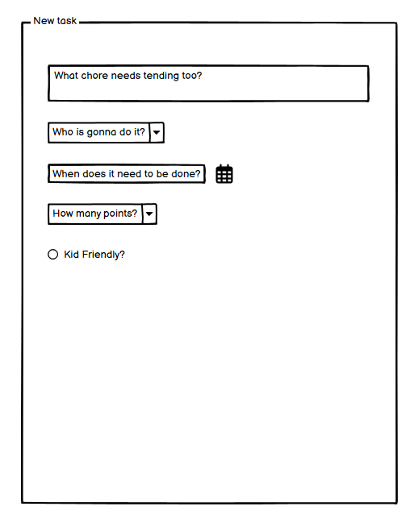
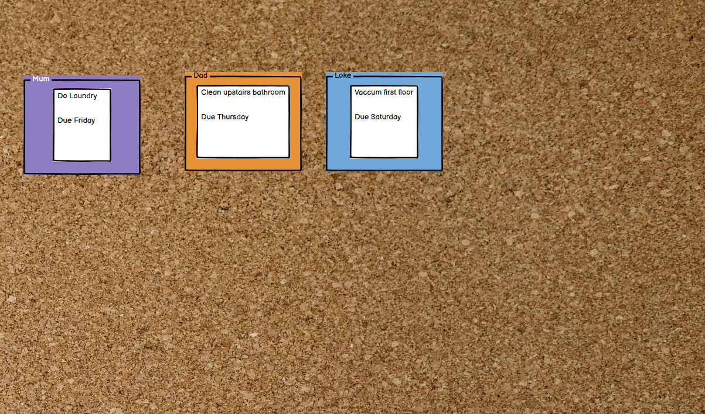
### The app on different screensizes
Since I have been using React Bootstrap 4 components like fluid Containers and Rows and Columns when creating this React App the website is fully responsive across different screen sizes and devices. 
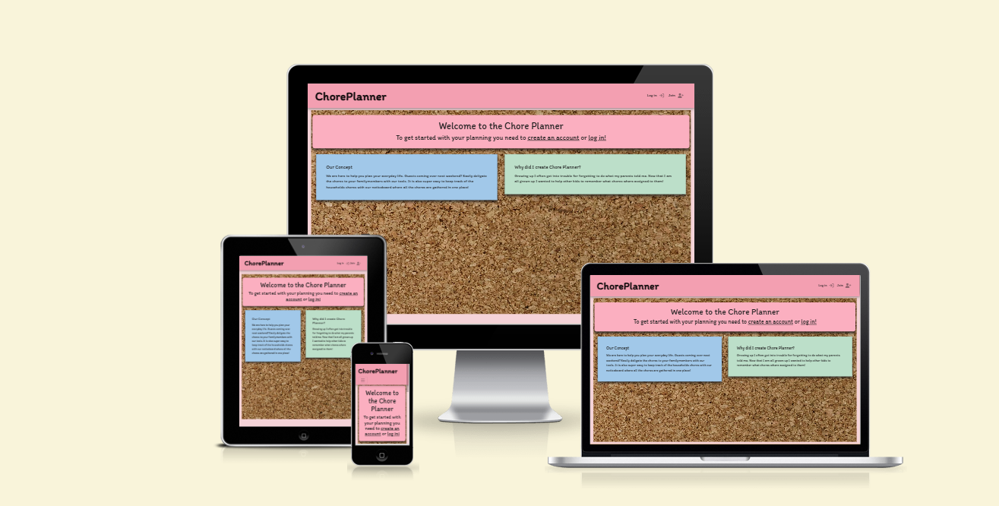

### Font
For this app I chose the Google Font Itim beacuse it has the playfull handwriting look I wanted for this website. 
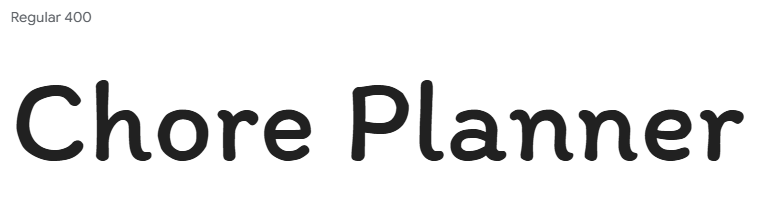 
### Icons 
In the navbar there are Font Awesome icons next to the name of each page to make it more interesting than just text. It also makes it easier for users with limited reading skills to understand how to navigate to the different pages.

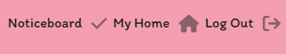

### Favicon
The favicon I used for this app is created using favicon.io. I chose the “check” as a symbol because of how you check off chores when done with them.  
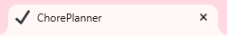

### Colour Scheme
The original colour palette was five “post-it” pastell colours but when starting to design the website I did not like the mix of all the different colours so I decided on a palette containg five shades of pink instead but I used the post-it colours on the landingpage and for the chore cards. I also created a palette with some different browns for the font.
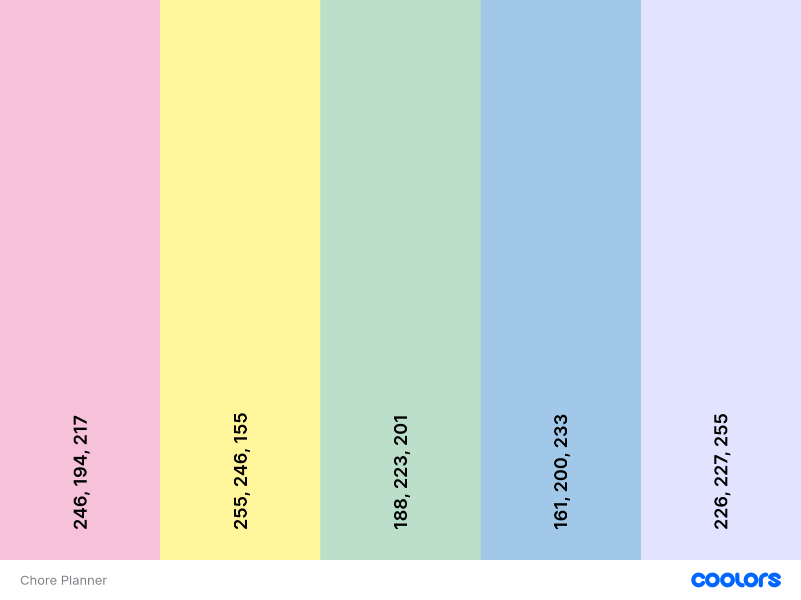
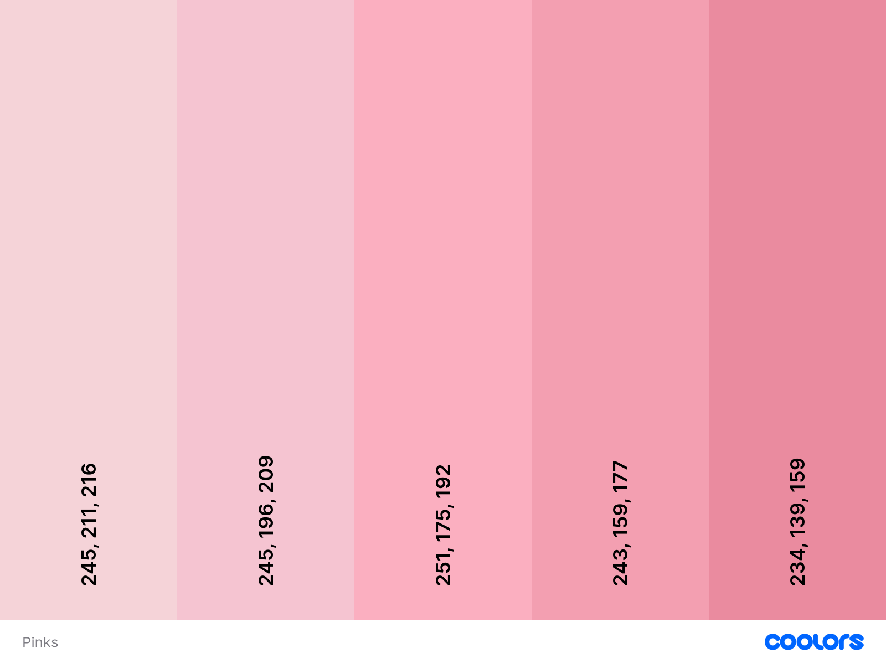
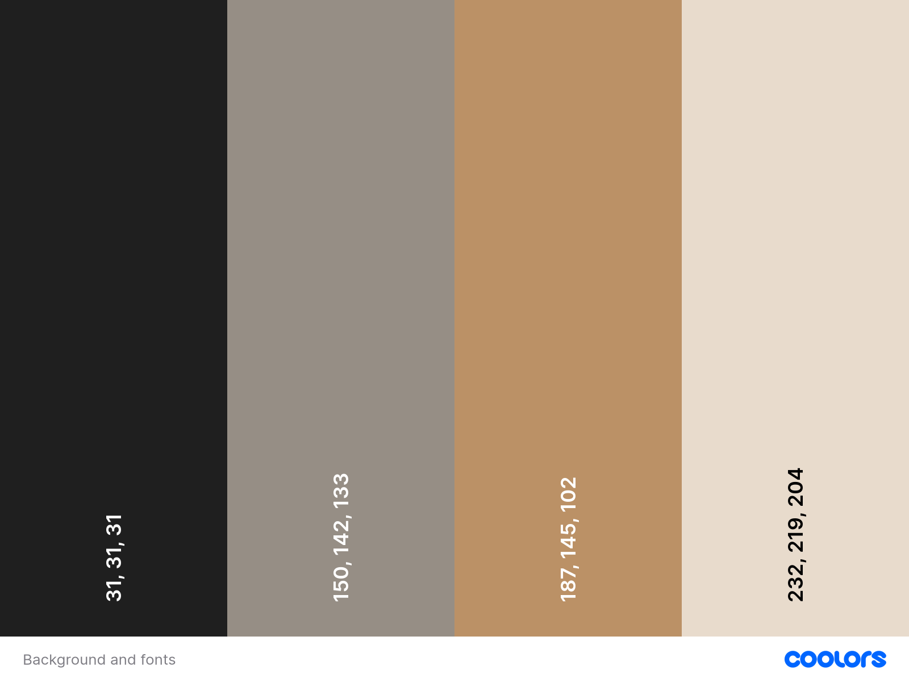

### Background
The Landing Page and the Chores noticeboard has a background that looks like an oldschool noticeboard made out of cork to match the vision I had for the webpage. 


## User Experience
### User Stories
After the idea for the website had sprouted in my mind I started writing the user stories. I created a custom template in github and added the issues to the project I created in my front-end repostitry. This to have a good view of what I need to do and how I am progressing in my work.  

I ended up with ten different user stories. Six must-haves, two should-haves and two could-haves. The only issues left in the "Todo" column are the two could-haves the other ones are done.
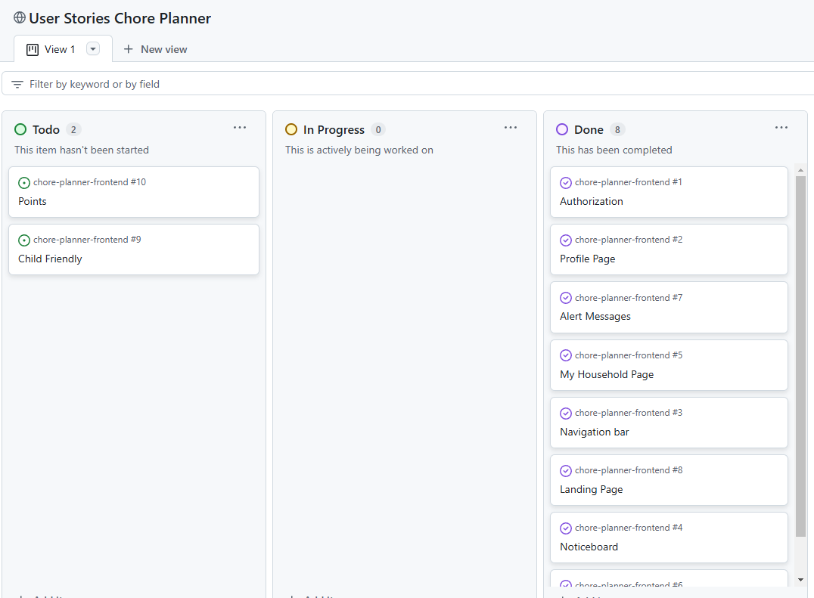

#### Custom Template
The custom template speeds up the process for adding a new issue to the project and helps make sure that the format is consistant.  
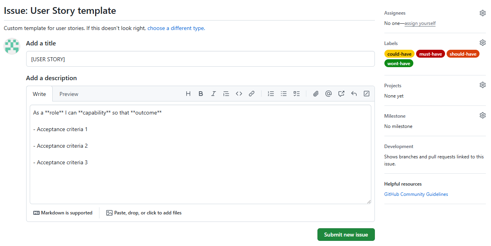

#### Must-have
The must-haves for Chore Planner was: Authorization, Noticeboard, Chores, Profile Page, My Home Page and Navigation Bar. 

##### Authorization
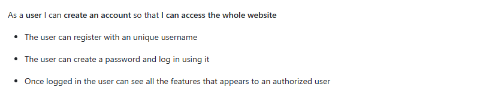
##### Noticeboard
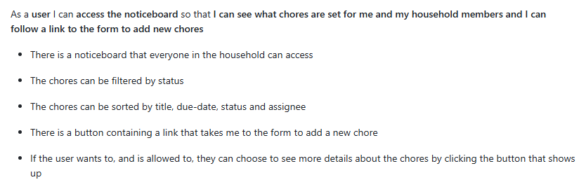
##### Chores
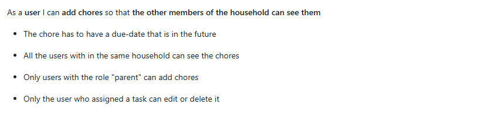
##### Profile Page
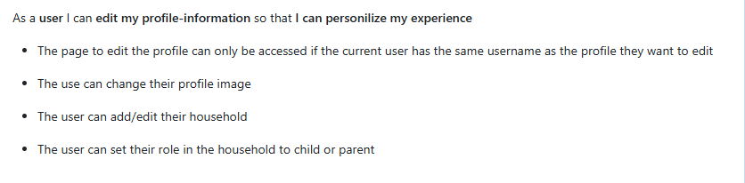
##### My Home Page
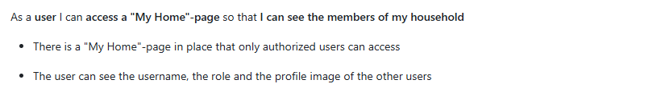
##### Navigation Bar
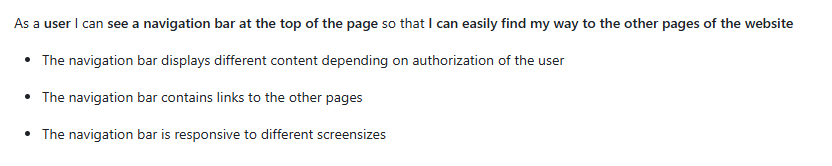

#### Should-have 
The should-haves for Chore Planner was: Landing Page and Alert Messages. 
##### Landing Page
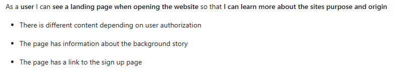
##### Alert Messages
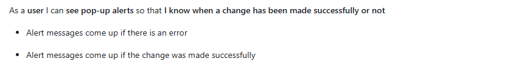

#### Could-have
The two could-haves for Chore Planner was: Points and Child Friendly.
##### Points
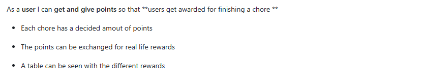
##### Child Friendly
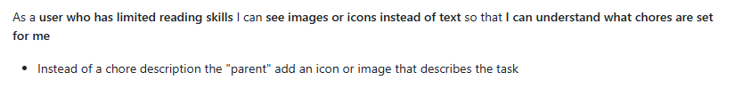


## Features

### Navigation Bar
``USER STORY: As a user I can see a navigation bar at the top of the page so that I can easily find my way to the other pages of the website. ``

At the top of the website there is a navigation bar that contains links to all the pages of the website. The content of the navigation bar differs if the user is authorized or not.  

On screens smaller than 768 px the links in the navbar are replaced with a “burger”-icon that toggles a dropdown menu containing the links.
#### Navigation Bar if user is authorized

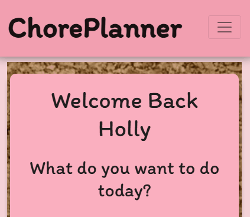

#### Navigation Bar if user is unauthorized

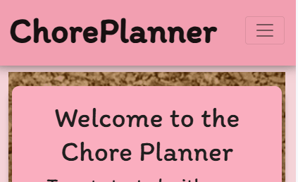

When hovering over the icons in the navigation bar the opasity of the text and icon increases to indicate to the user that they can click the link. The link to the page that is active has a static increased opasity to show what page the user is currently on. 
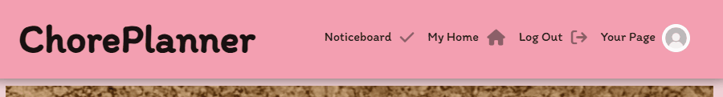


### Landing Page
``USER STORY: As a user I can see a landing page when opening the website so that I can learn more about the sites purpose and origin. ``

The Landing Page contains a welcome message that changes depending on authorization, a short text about the concept of the website and a short text about why I created the page. The page also contains a message for users who are not authorized encouriging them to sign up and a link to the sign up form.
#### Authorized
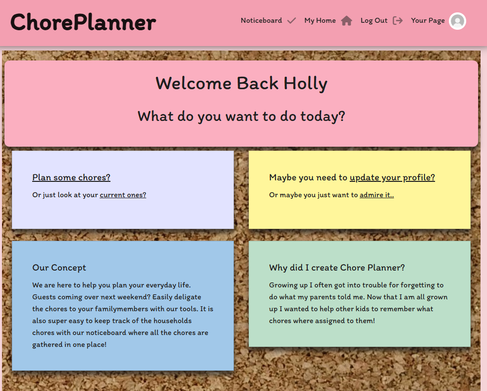
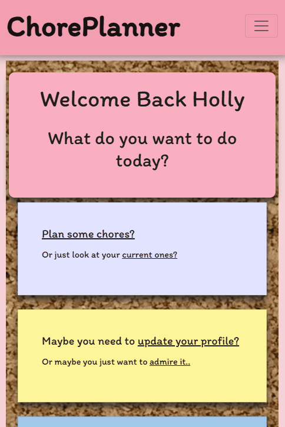
#### Unauthorized
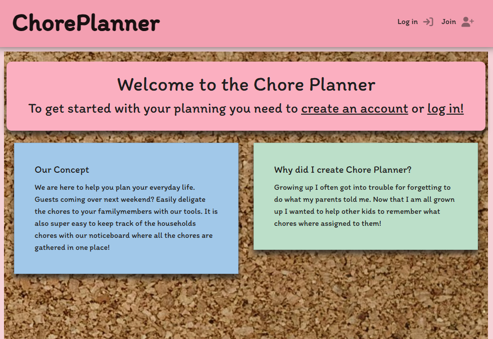
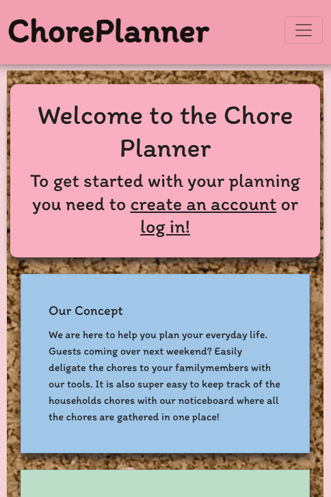

### Noticeboard
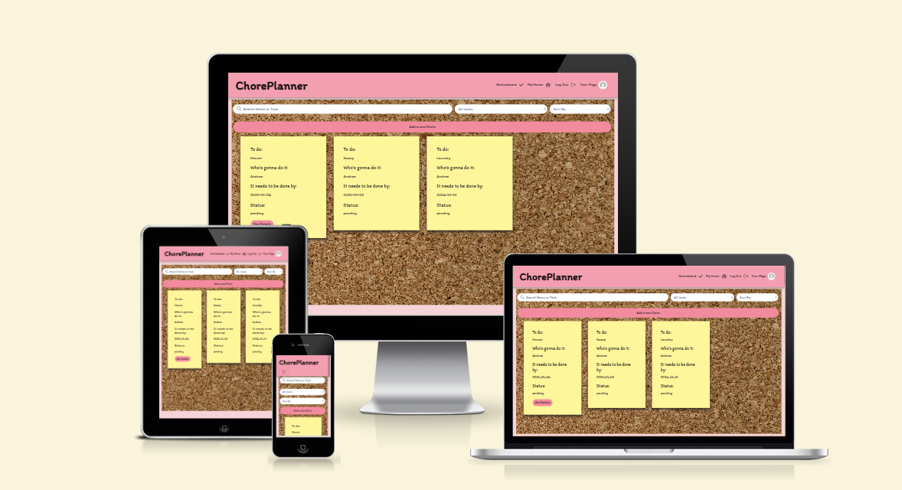
``USER STORY: As a user I can access the noticeboard so that I can see what cores that are set for me and my household members and I can follow a link to the form to add new chores.``

The Noticeboard page is a page where the user can see all the chores that are set for their household. The content of this page differs depending on role, household and the existence of chores. 

The cards with the chores on them on this page is just a preview of the chore and if the user wants to see more details they need to click the button that says “see details”. The user is then taken to the chore detail page. This button only appears if the current user is the one who created the chore or the one that the chore is assigned to.

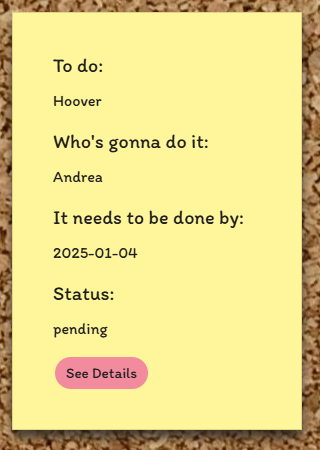
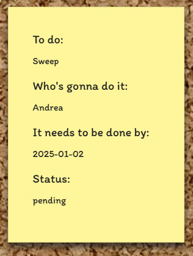

If the user has the role of Parent and is a member of  a household the page looks like the images bellow. At the top there is a form containing a searchbar, a filter dropdown menu, a “order by” dropdown menu and button that only appears if the current user has the role of Parent. In the searchbar the user can search for a specific chore or chores assigned to a specific household member. The user can use the filter dropdown to filter the chores depending on their status. The button is a link to the page containing the form to create a new chore. 

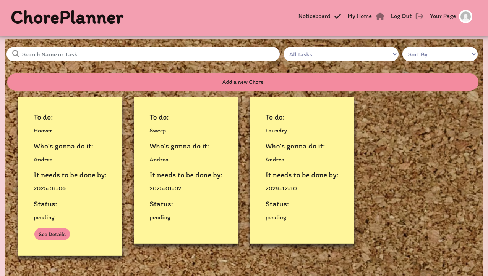
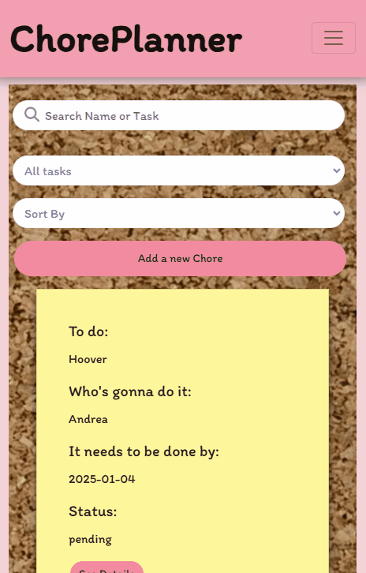

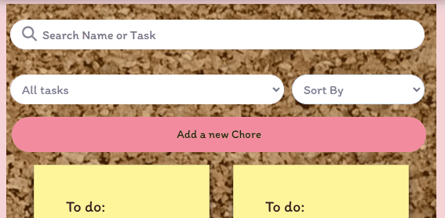

If the user has a household but has the role of Child the Noticeboard page will look like the image bellow. The searchbar and filter and order dropdowns are still there but not the button that takes the user to the create form for the chores. 
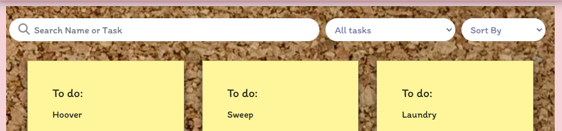

If the user has a household but there are no chores set for anyone in the household they will see a message that there is nothing for them to do right now. 
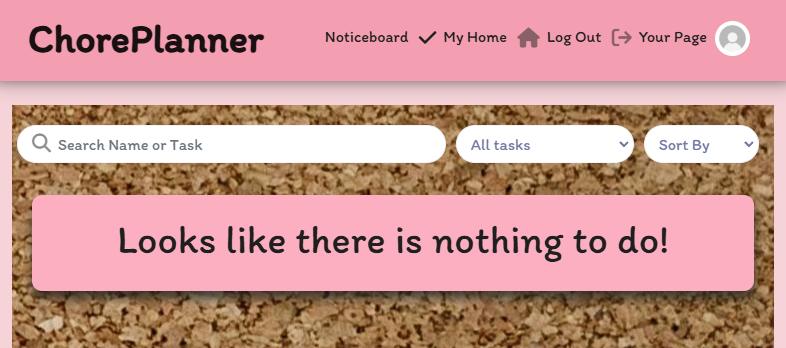

If the user does not have a household connected to their profile they will not see the form at the top containing the searchbar etc and they will be met with a message that they need to be a part of a household to be able see this page and a button containing a link that takes them to the form to edit their profile.

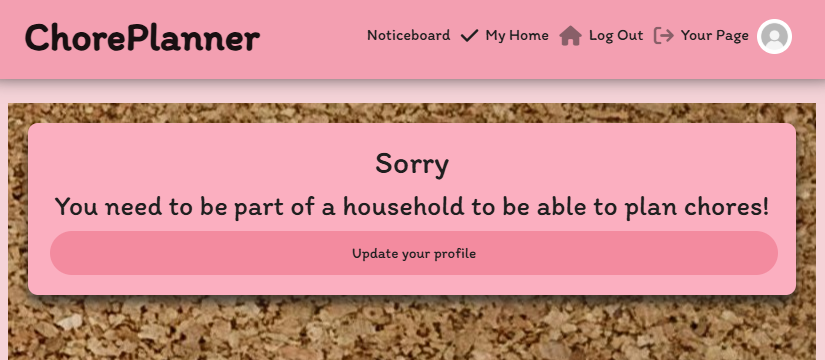

### Chore Create Form
``USER STORY: As a user I can add chores so that other members of the household can see them.``

When the user clicks the button that says “Add a new chore” they are taken to a form where they can create a new chore. The user needs to input a chore title, description, due date and they also need to choose who is gonna do the chore. All the fields are required to create a chore. When a chore is created the task_giver is automatically set to be the current user and the status is by default “Pending”. 

The due date field is a DatePicker from the library react-datepicker. It is checked in the API to make sure that it is not set in the past. 
 

The dropdown where the user chooses who is gonna do the chore only the names of the users with the same household name appears. 
 

When the user then clicks the button to add the chore they are redirected to the newly created chores details page. 
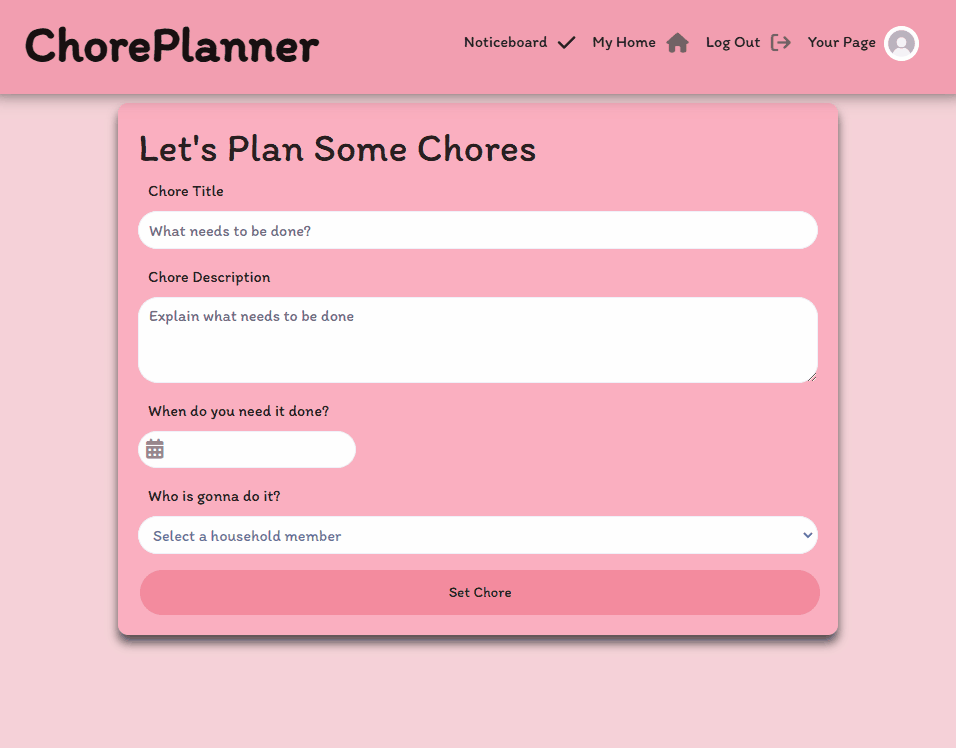

### Chore Detail Page
On this page the user sees details about the chore in question. They can see the title, the description, who it was assigned to, the due date, the status and who created the chore. If the current user is the one who created the chore the button to the edit chore form appears. 

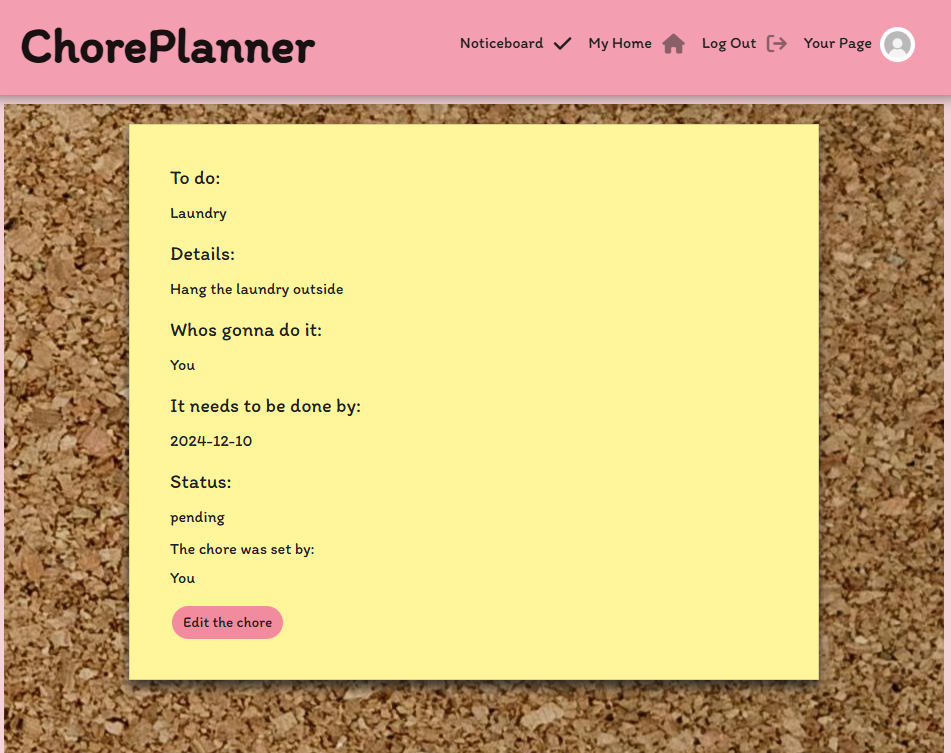
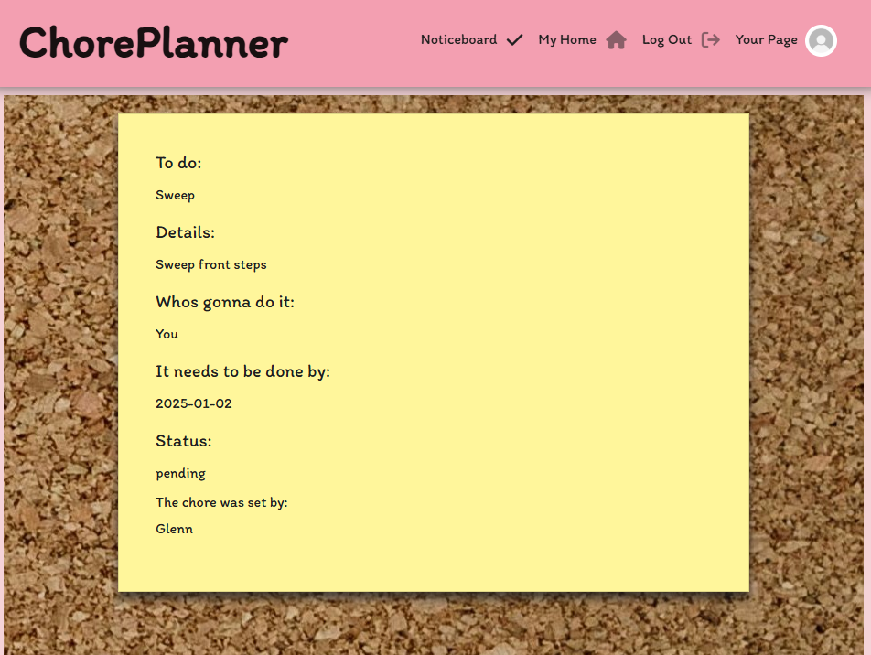

### Chore Edit Form
This form can only be accessed by the user who created the chore. If the user manually change the url and try to access a chore they did not create they will be redirected to the noticeboard and get a pop-up message. The form looks  almost identical to the Create Chore Form but it has the data from the chore in question in its fields and the user can change the stauts of the chore. The user can choose to either update the chore or if they want to delete it.

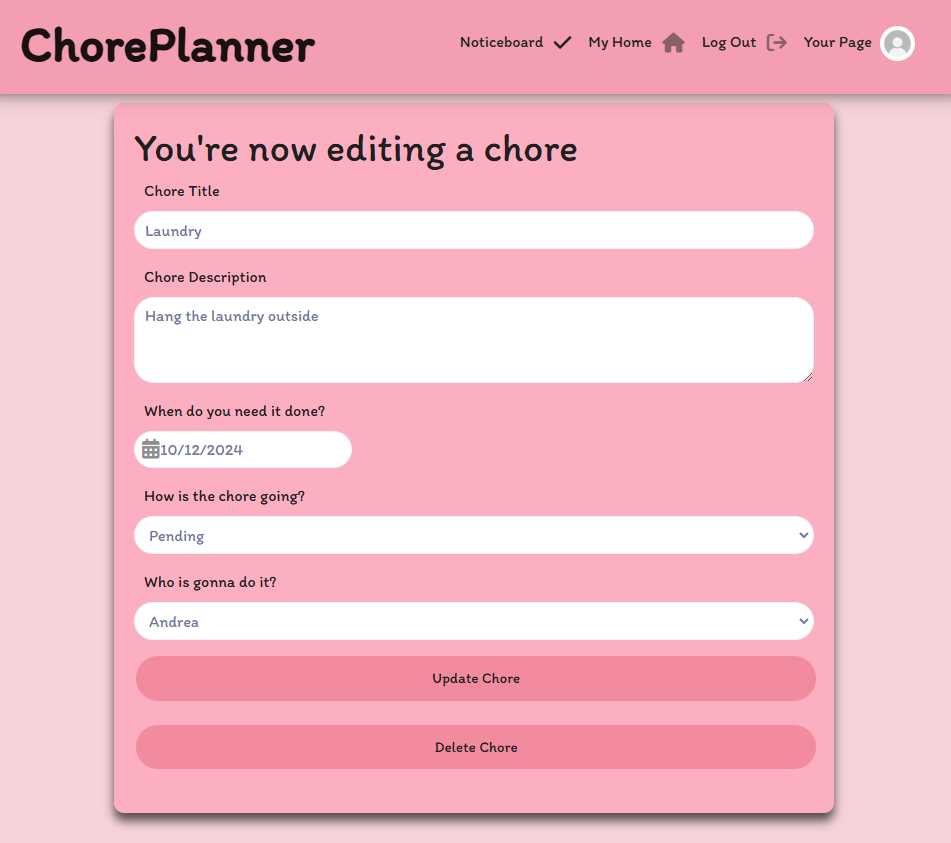
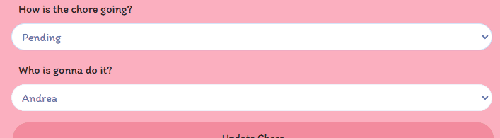


## Deployment

### Deploying the API

#### Preperations
- Connected the project to the PostgreSQL and added the config var for the database to Heroku 
- Installed corsheaders and gunicorn
- Ran ``` pip freeze --local > requirements.txt ``` in the teminal to update the dependencies
- I added the Procfile
- Updated the ALLOWED_HOSTS to contain '.herokuapp.com'
- Added the corsheaders middleware to MIDDLEWARE in settings.py
- Set the ALLOWED_ORIGINS
- Set my SECRET_KEY in the env.py 
#### Deploying to Heroku
- Added the config vars for the secret key and cloudinary
- Connect the Herokuapp to the correct github repository
- Deployed main branch 
- Made sure the app works as intended